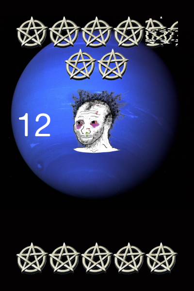
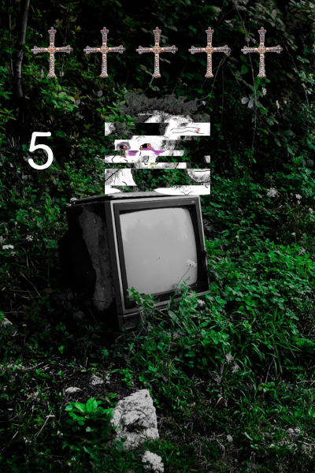

# GLITCH TAROT

A very simple tarot-generating app, written in Flask with python.
There is no deck of cards to draw from. Instead, we build each card from basic elements. Most of those elements have a chanced of being "glitched." The glitches increase the uniqueness of each card.

The images never get saved to disk. If the user wants to keep them they must save them to their own disk once delivered.

The web app has four main endpoints:

* `/`             the main page which lets the use pick how many cards to draw and whether they can be randomly "reversed"
* `/img`        delivers one PNG file to the client
* `/discord`    (post) takes args for how many images, returns a ZIP file full of PNGs
* `/draw`       (post) called by main page, takes args for # of imgs and if reversals allowed, returns HTML page with images embedded in the HTML (no links)

## ELEMENTS OF EACH CARD
* Background (landscape / setting)
* Symbol (similar to Suit in normal cards)
* Subject (person/persona/archetyp)
* The Subject is situated between the Object (symbol) and the World (Background image)

## ALT TEXT
* On the /draw web page the images all have alt description text included in the HTML tags. It's not currently embedded in the image's meta data, and it's not delivered with the ZIP file. Future iterations of the app may include this in the discord-bound ZIP file endpoint.

## GLITCHES
We have two functions to glitch an image-element. One is a "shift" glitch, which randomly chooses rows of pixels to shift left or right, wrapping around to the other side. The other is a color glitch, where we adjust the RGB values of randomly-selected rows of pixels.

## EXAMPLES

